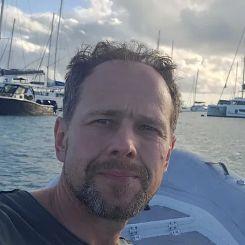
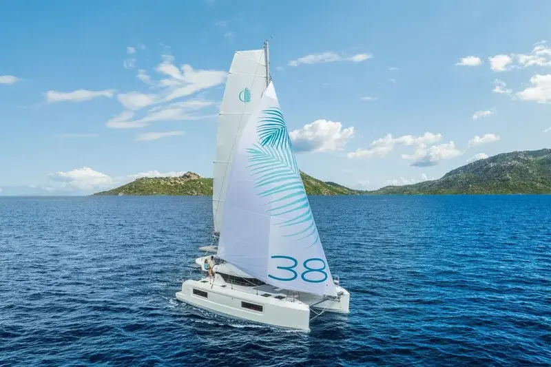

                Featured Guide

                5 min read

                Route Guide • Ibiza 2026
                •
                September 2026

## Sailing Ibiza and Formentera in October: what the week actually looks like

Most people picture Ibiza in August: full marinas, €18 cocktails, boats rafted three deep in every bay. October is a different island. The charter fleet has thinned out, the anchorages are half empty, and you can still swim without thinking twice about it.

                 

                  Robertas Vaitiekūnas
                  Skipper • Vela Vida

               [Read Article &rarr;](sailing-ibiza-formentera-october.html)

             

                Flotilla Archive

                Route History

## The Sicily & Aeolian Islands Flotilla Recap

How we sailed the Aeolian volcanic archipelago on a Lagoon 38, navigating sea conditions and building our crew format.

              Past Expedition
               [View Route ↗](../sicily-2026.html)

### Planning your first flotilla?

Read through the FAQ or message Skipper Robertas directly on Instagram for straightforward answers about cabin layout, seasickness, and crew matchmaking.

             [Read Flotilla FAQ](../faq.html)
             [Inquire About Ibiza 2026](../index.html#join)

```json
{
  "@context": "https://schema.org",
  "@graph": [
    {
      "@type": "Blog",
      "@id": "https://www.velavidasails.com/blog/#blog",
      "name": "Vela Vida Yachting Journal",
      "description": "Authentic sailing logs, route breakdowns, and flotilla guides direct from skipper Robertas Vaitiekūnas.",
      "url": "https://www.velavidasails.com/blog/",
      "publisher": {
        "@type": "Organization",
        "name": "Vela Vida Yachting",
        "url": "https://www.velavidasails.com/",
        "logo": "https://www.velavidasails.com/images/VelaVidaLogo.webp"
      }
    },
    {
      "@type": "BreadcrumbList",
      "@id": "https://www.velavidasails.com/blog/#breadcrumb",
      "itemListElement": [
        {
          "@type": "ListItem",
          "position": 1,
          "name": "Home",
          "item": "https://www.velavidasails.com/"
        },
        {
          "@type": "ListItem",
          "position": 2,
          "name": "Journal",
          "item": "https://www.velavidasails.com/blog/"
        }
      ]
    }
  ]
}
```
