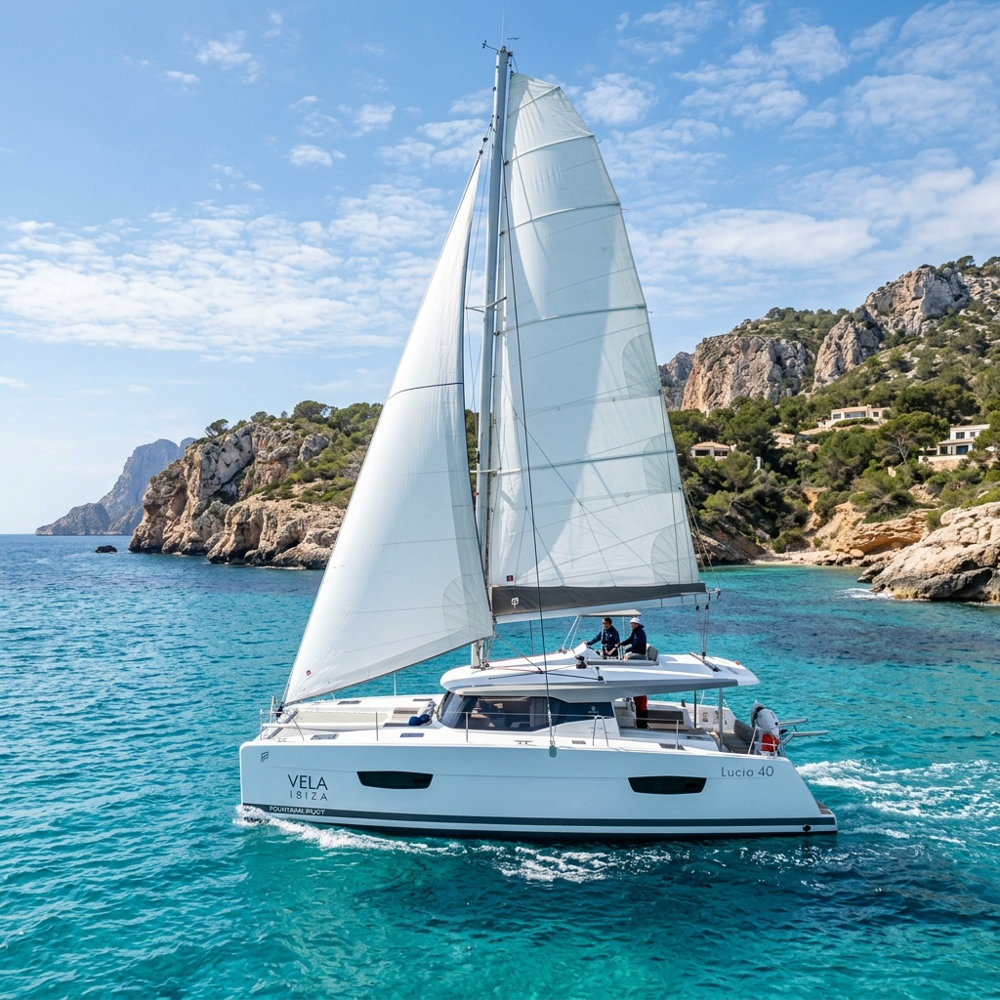
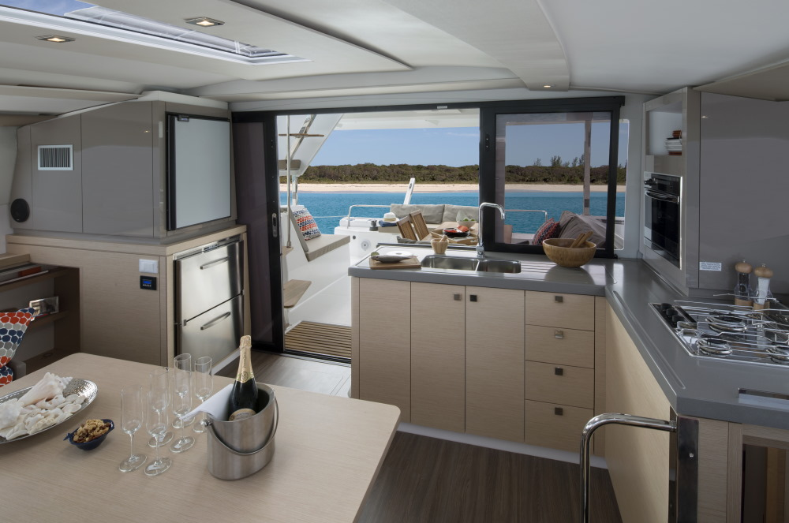
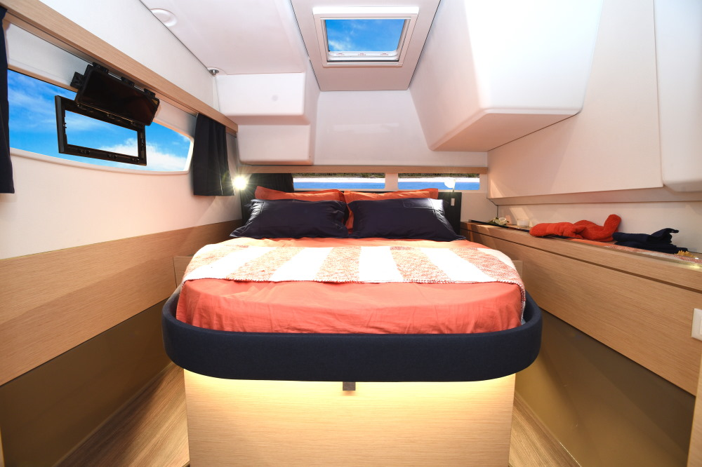
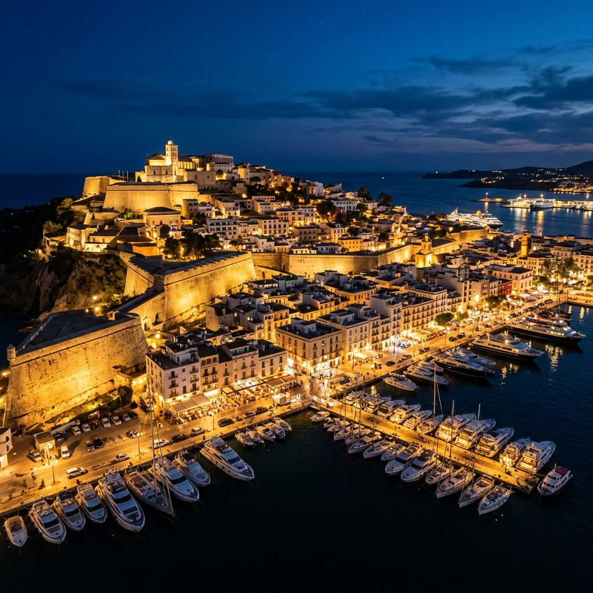
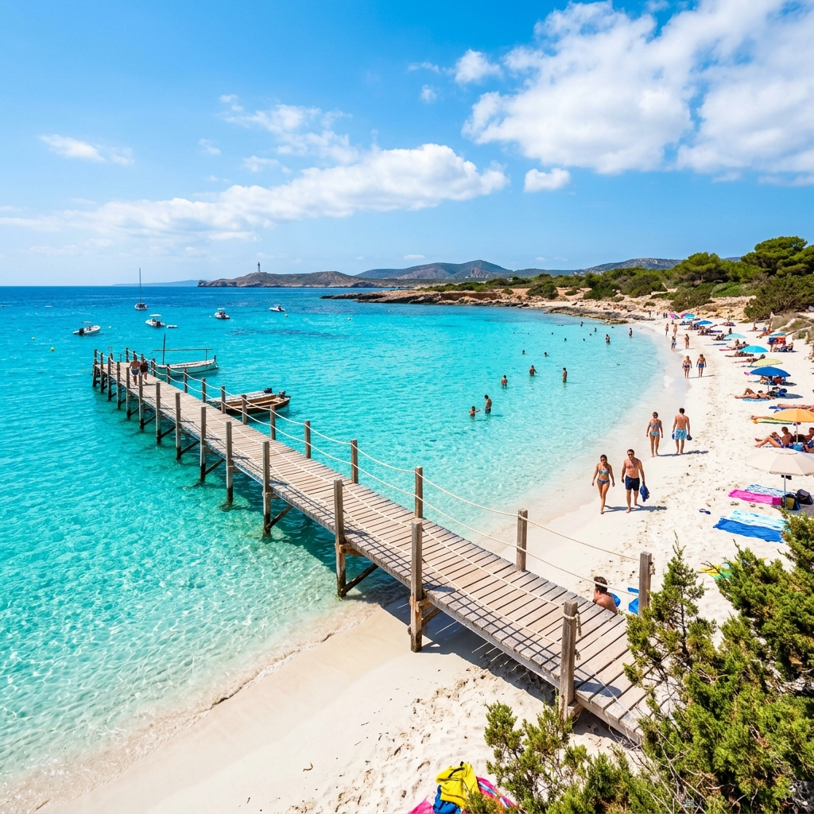
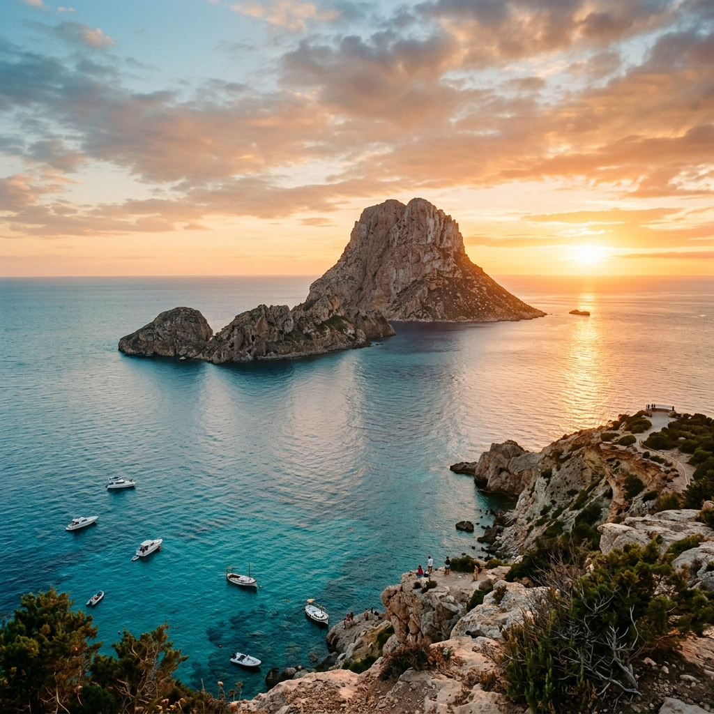
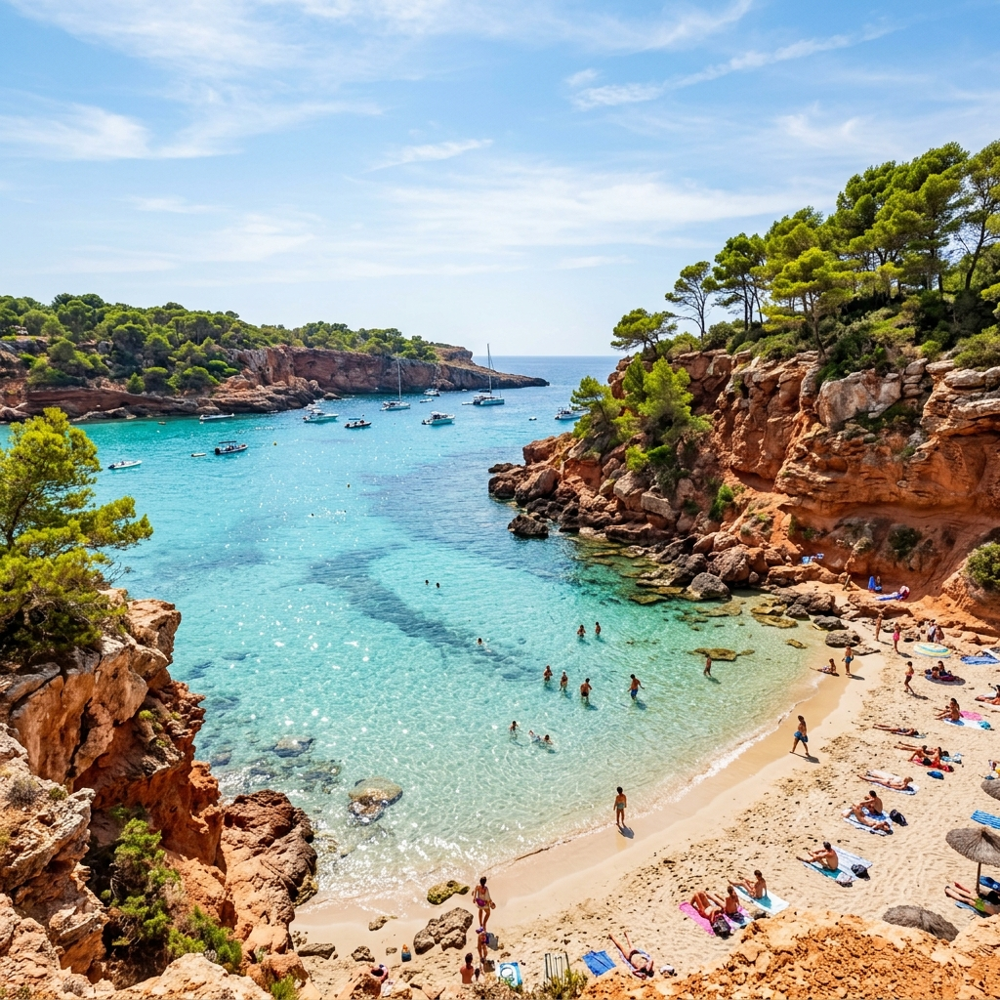
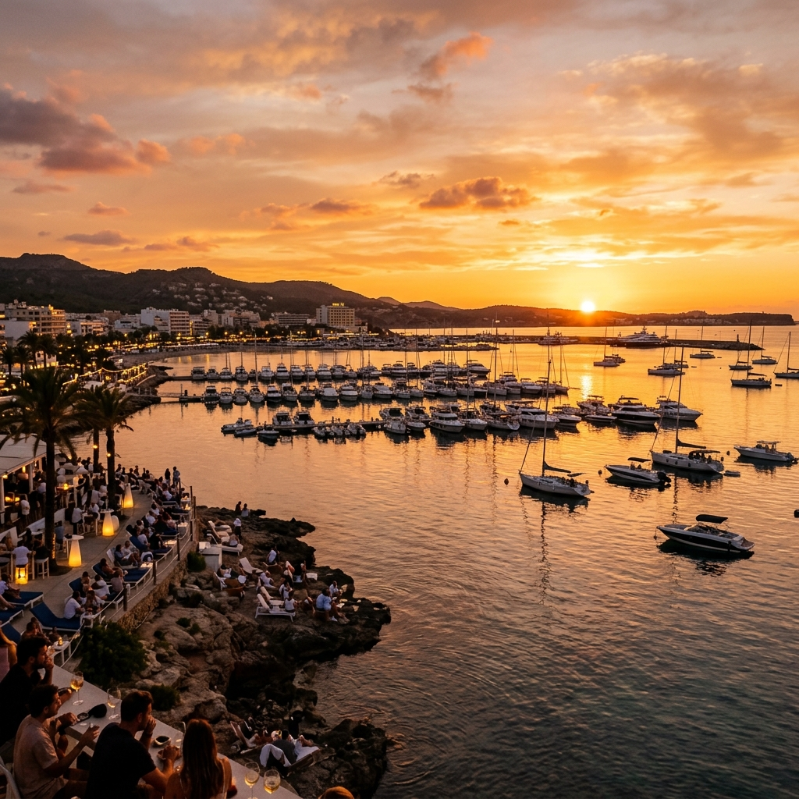
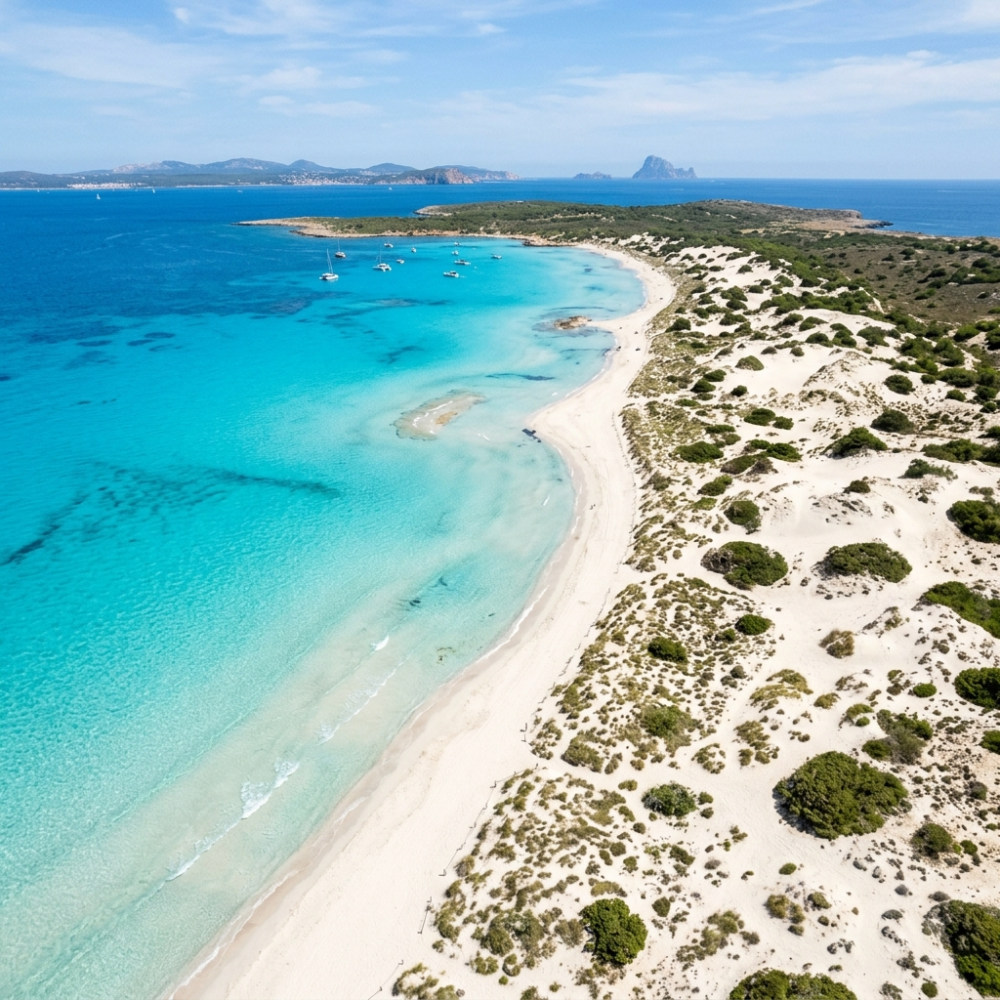

## Another Destination. The Same Flotilla Magic.

Think dramatic cliffs, Balearic sunsets, crystal-clear turquoise waters,
          and rich old-town culture… all paired with the best community
          sailing experience you’ll find anywhere.

            ⚓

### What is a Flotilla?

It's a sailing trip with 5-8 yachts traveling together. You will have an active week with more than 50 new people! One yacht is 8 people maximum. So you will always have your little family and a big family around. Networking, life experience sharing, and even new potential partners!

### How It Works

- 01
              Live and travel on the catamaran between beautiful bays.
- 02
              Explore Es Vedrá, Cala Saona, and secret spots hidden from land.
- 03
              Learn to sail from experienced captains or just relax.

            ☀

### A Floating Collective

This isn’t just a holiday. It’s a week-long celebration. Meet like-minded people, build soul-enriching connections, and discover the joy of sailing. Our goal at this event is to open the sailing world to more people!

                 

                Exterior Style

                 

                  Saloon Comfort

                 

                  Cabin Comfort

                  40ft

                  Length

                  8

                  Berths Max

          The Yacht

## Award-Winning Lucia 40

Sail aboard the **Fountaine Pajot Lucia 40 (2019)**, a masterclass in modern catamaran architecture. Offering space, light, and unmatched stability that monohulls simply cannot match, she is a floating villa with 360° sea views.

- 🌊

### Unmatched Stability

                  No heeling over while sailing. Perfect for beginners and those
                  who want to relax with a drink in hand while underway.
- 🛋️

### Indoor-Outdoor Flow

                  4 private double cabins and 2 spacious bathrooms. The saloon and cockpit connect into one massive living deck.
- ⛵

### Modern Sailing

                  An exceptionally well-balanced catamaran that performs beautifully under sail.

           [See Price](#pricing)

            The Itinerary

## The Ibiza Route

Flexible route subject to weather.

              Start/End: Ibiza Town (Eivissa)

                01

### Ibiza (Eivissa)

Ibiza is an island for both "party-club" and nature lovers. You can come 1-2 days before the trip starts and explore it. On the first day, we often dive into the old town. Narrow, busy streets with ice-cream corners and handcraft shops. Ancient fortress and a magnificent view of the port and the city from the top of it at night.

               

               

                02

### Formentera

We guess many photoshoots for magazines and ads took place here. Just look at the color of the water! We anchor here for a lazy day of swimming, walking barefoot on the beach, and snorkeling. Often, here are many fish in the water as the Poseidonia grows at the bottom.

                03

### Es Vedra

These mystique cliffs are waiting for us to show their majesty. As we get closer to our yachts, our faces will represent all kinds of positive emotions: curiosity, joy, amazement, and calm. We drop our SUP boards on virgin clean water and explore this location.

               

               

                04

### Cala Saona

This bay perfectly represents Ibiza/Formentera. You can stay at the beach club and enjoy cocktails or hike in the pine forest with the viewpoint at the end.

                05

### Sant Antoni de Portmany

There are only three words to explain the cherry on top of this place: sunset, Cafe del Mar, and cocktail. We often hurry to dock in the marina here to catch the sun going down. Cafe del Mar is the famous author of the lounge tracks known worldwide.

               

               

                06

### Espalmador

We're staying in a wild bay in a national reserve. On the beach, we're going to take some drone footage among the dunes and strange plants.

You don't need any previous experience to join the team for this trip.

The route is flexible and can be changed due to the weather. Let's talk about it!

          Meet Your Captain

## Your Skipper

                 

                ⚓ Skipper

### Robertas Vaitiekunas

Captain & Sailing Enthusiast

Following our highly successful **Sicily 2026 Flotilla**, where I commanded a Lagoon 38 with a flawless safety record and exceptional crew satisfaction, I am returning to take the helm for our Ibiza expedition. Meticulous route charting, weather monitoring, and ensuring a safe, positive environment are the core parameters of my skipper approach.

I hold international ISS skipper credentials and am trained on both monohull and catamaran systems. With the experience from Sicily behind us, we are upgrading to a modern Lucia 40 to bring our sailing crew even more space, comfort, and performance.

                🧭
                Proven Command
                Successfully led Sicily 2026

                🌊
                ISS Licensed
                Internationally certified skipper

                ⛵
                Dual Trained
                Monohull & catamaran experience

                🤝
                Safety First
                Your safety is non-negotiable

          The Investment

## Join the Expedition

Book your berth on our Fountaine Pajot Lucia 40 catamaran.
October 10-17, 2026.

### ✓
              What's Included

- ● Yacht Charter &
                Insurance
- ● Professional Skipper
- ● Dinghy & Outboard
                Engine
- ● Final Yacht Cleaning
- ● Bed Linen & Towels
- ● Sailing Guidance &
                Training
- ● Pre-trip Planning
                Assistance

                Active Booking

                Lucia 40 Catamaran

              €890
              per person

               [Inquire Now](#join)

Berths are limited to 8 max.

### ✕
              Additional Costs

- ●

                  Operating Kitty (~€200)
                  Covers fuel, marina fees, and breakfast/lunch provisions.
- ●

                  Security Deposit (€250)
                  Fully refundable if no damages occur.
- ● Flights & Transfers
- ● Dinners at
                Restaurants

            Active Booking

## Join the Flotilla

Ready to explore Ibiza aboard a luxury catamaran? Send us an inquiry to request booking details or set up a crew call!

              Name

              Email

              Message / Request

                Send Request

          We use cookies to enhance your experience. By continuing to visit this
          site you agree to our use of cookies.
           [Read our Privacy Policy.

            Accept](privacy.html)

```json
{
  "@context": "https://schema.org",
  "@type": "Event",
  "name": "Ibiza & Formentera Catamaran Week 2026 — Catamaran Week aboard Fountaine Pajot Lucia 40",
  "description": "A 7-day catamaran sailing week along Ibiza and Formentera aboard a Fountaine Pajot Lucia 40 catamaran. Book a single berth — solo travellers welcome, no sailing experience needed. Route: Ibiza Town, Formentera, Es Vedrà, Cala Saona, Sant Antoni, Espalmador.",
  "startDate": "2026-10-10",
  "endDate": "2026-10-17",
  "eventStatus": "https://schema.org/EventScheduled",
  "eventAttendanceMode": "https://schema.org/OfflineEventAttendanceMode",
  "image": "https://www.velavidasails.com/images/lucia-40-exterior.png",
  "location": {
    "@type": "Place",
    "name": "Marina Ibiza — Ibiza Town (Eivissa)",
    "address": {
      "@type": "PostalAddress",
      "addressLocality": "Ibiza Town",
      "addressRegion": "Balearic Islands",
      "addressCountry": "ES"
    }
  },
  "offers": {
    "@type": "Offer",
    "name": "Berth on Fountaine Pajot Lucia 40 catamaran",
    "price": "890",
    "priceCurrency": "EUR",
    "availability": "https://schema.org/InStock",
    "validFrom": "2026-01-01",
    "url": "https://www.velavidasails.com/#pricing"
  },
  "organizer": {
    "@type": "Organization",
    "name": "Vela Vida Yachting",
    "url": "https://www.velavidasails.com/"
  },
  "performer": {
    "@type": "Person",
    "name": "Robertas Vaitiekunas",
    "jobTitle": "Skipper"
  }
}
{
  "@context": "https://schema.org",
  "@type": "Organization",
  "name": "Vela Vida Yachting",
  "url": "https://www.velavidasails.com/",
  "logo": "https://www.velavidasails.com/images/lucia-40-exterior.png",
  "email": "join@velavidasails.com",
  "sameAs": [
    "https://instagram.com/velavidasails"
  ]
}
```
