This is the archived page of the completed Sicily 2026 trip.  [View our active Ibiza 2026 sailing adventure →](index.html)

## Another Destination. The Same Flotilla Magic.

Think rugged coastlines, Mediterranean sunsets, volcanic landscapes,
          and rich Italian island culture… all paired with the best community
          sailing experience you’ll find anywhere.

            ✦

### What is a Flotilla?

It's a sailing festival with 5-6 yachts traveling together. Imagine
            an active week with 50+ new faces. You have your "little family"
            (your crew of ~10) and a "big family" (the whole fleet).

### How It Works

- 01
              Live and travel on the yacht between islands.
- 02
              Explore bays and secret spots hidden from land travelers.
- 03
              Learn to sail from experienced skippers or just relax.

            ☀

### A Floating Festival

This isn’t just a sailing trip. It’s a week-long celebration. Meet
            new friends, kindred spirits, or just soulful connections. Our goal
            is to open the sailing world to more people with the best price
            offer of the year.

                 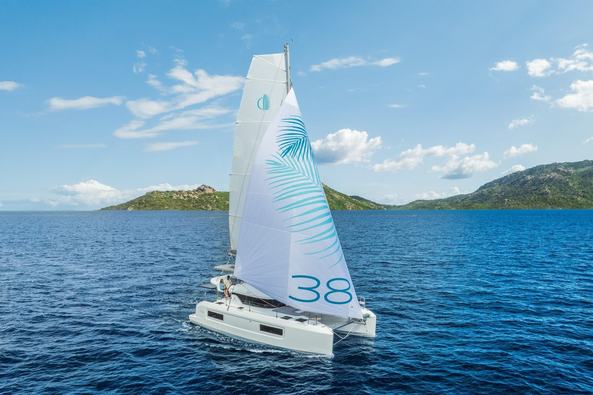

                Exterior

                 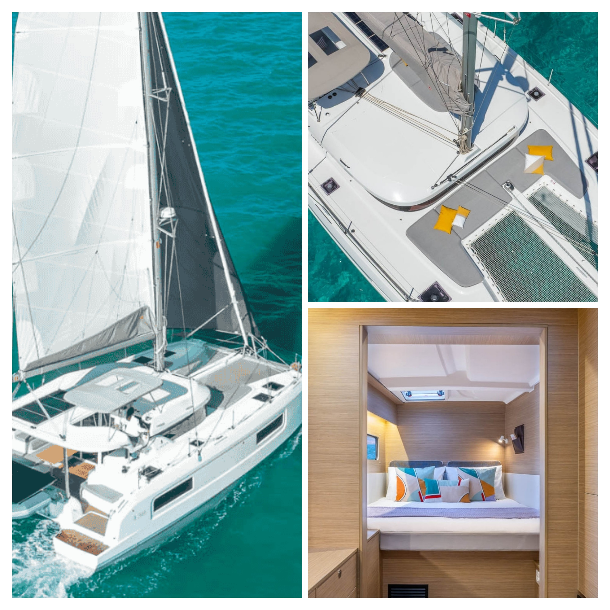

                  Interior Comfort

                  38ft

                  Length

                  10

                  Berths

          The Yacht

## Award-Winning Lagoon 38

Sail aboard the  **Lagoon 38** , a legend in the charter
            world and winner of multiple cruising awards. This isn't just a
            boat—it's a floating villa with 360° sea views, offering stability
            and space that monohulls simply can't match.

- #### Unmatched Stability

                  No heeling over while sailing. Perfect for beginners and those
                  who want to relax with a drink in hand while underway.
- #### Living Space

                  4 private double cabins and spacious common areas. The "In &
                  Out" design connects the saloon and cockpit into one massive
                  living deck.
- #### Eco-Conscious

                  Featuring modern construction with eco-friendly materials and
                  efficient cruising performance.

           [See Availability](#join)

            The Itinerary

## The Aeolian Route

Flexible route subject to weather.

              Start/End: Palermo (PMO)

                01

### Palermo Start

Your first taste of the magical island. Excitement builds as we
                gather in this historic capital. Provisioning, meeting the crew,
                and the first Italian dinner together before setting sail.

                 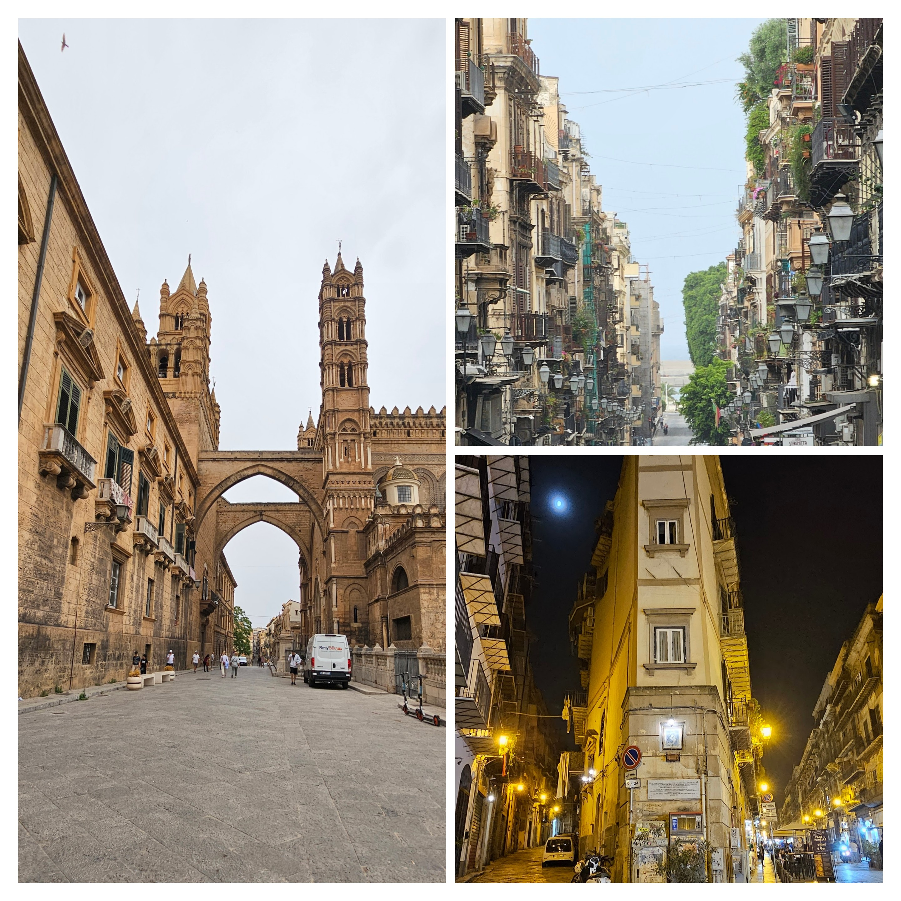

                 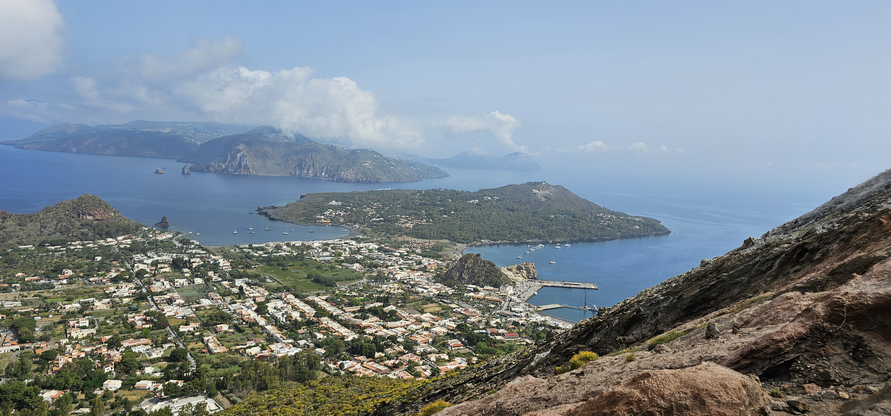

                02

### Vulcano

Where the land breathes! Explore famous mud baths and hot
                springs. Adventure seekers can hike the smoking crater for
                breathless views. Feel the volcanic warmth beneath your feet.

                03

### Panarea

The picture-perfect island for your Instagram. Stroll narrow
                streets, discover hidden cafes and boutique shops. As the sun
                dips, join the lively atmosphere at local trattorias. Where
                relaxation meets chic.

                 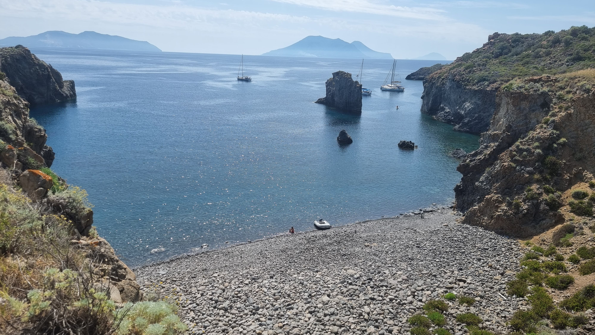

                 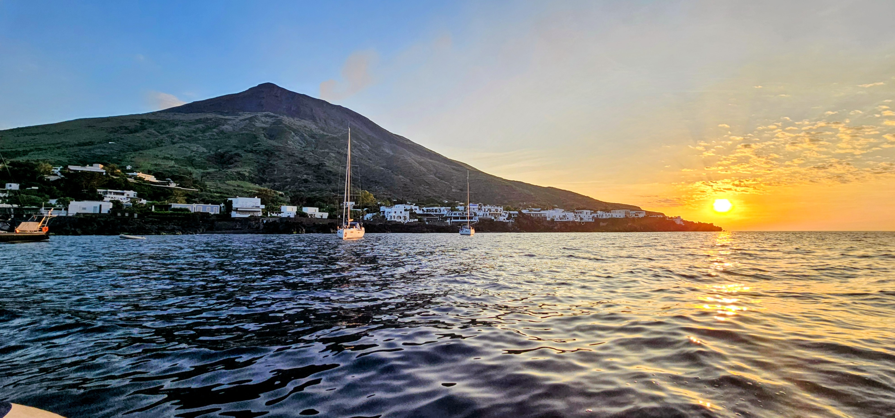

                04

### Stromboli

A fiery masterpiece. Witness volcanic eruptions lighting up the
                night sky. Dine on unique black sand beaches under the stars and
                feel the raw power of nature.

                05

### Salina

The green jewel of the archipelago. Lush landscapes, endless
                vineyards, and the famous Malvasia wine. Explore quiet old
                villages and enjoy the authentic Mediterranean summer vibe.

                 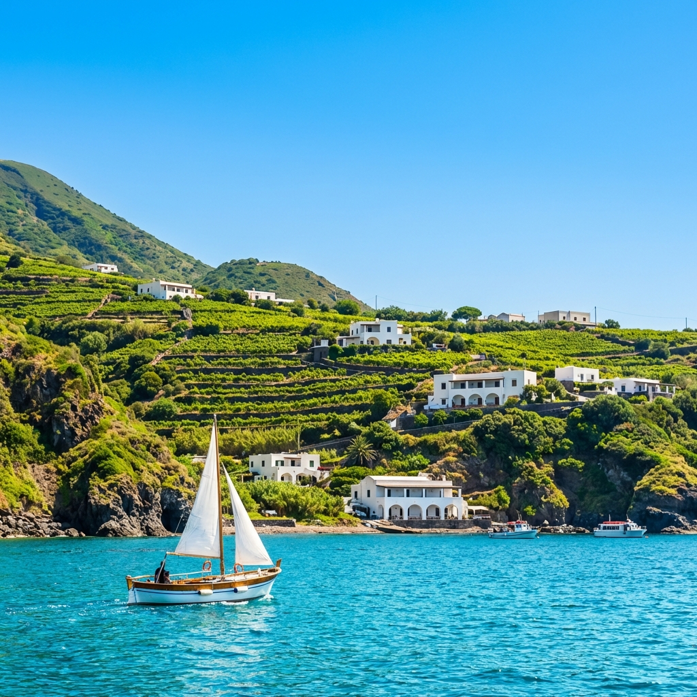

                 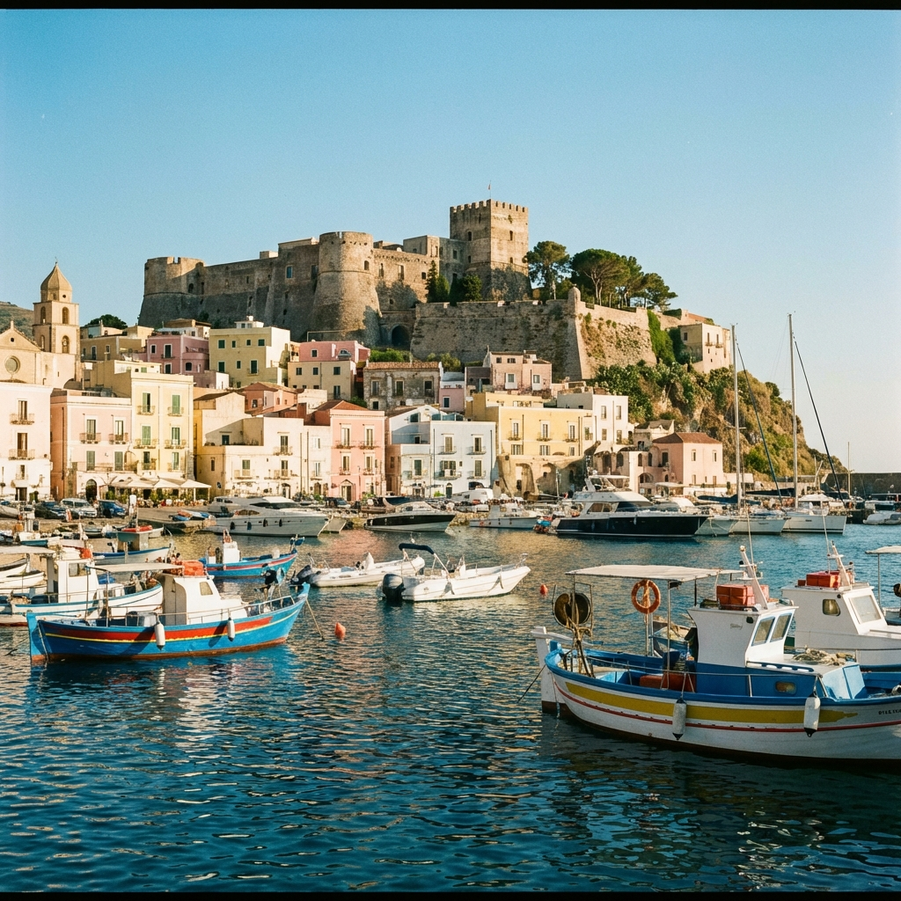

                06

### Lipari

The heart of the islands. Wander through historical sites, visit
                the imposing castle, and explore vibrant markets. End the trip
                with a stunning sunset view from the harbor.

          Visual Log

## Moments at Sea

               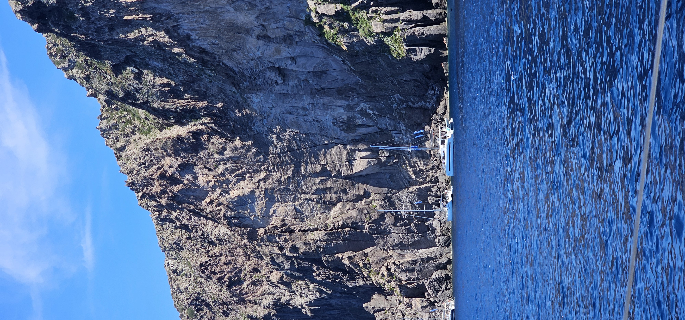

               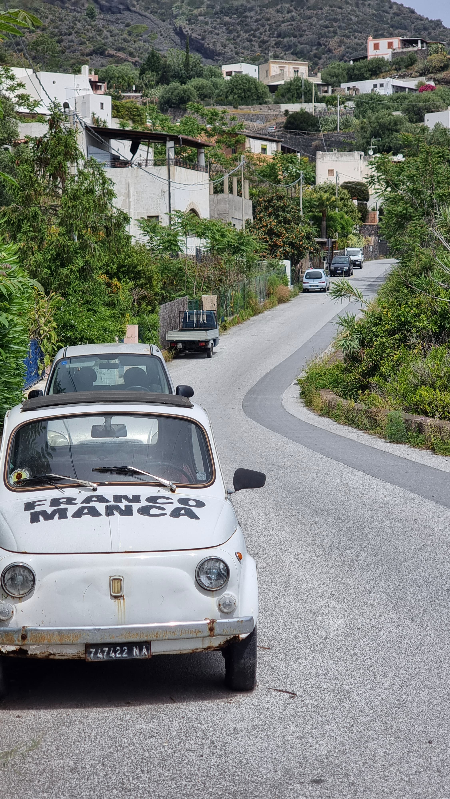

                Video

               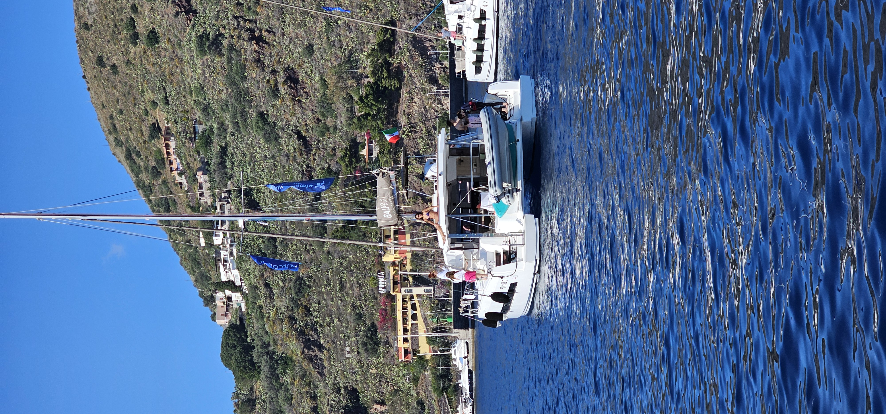

               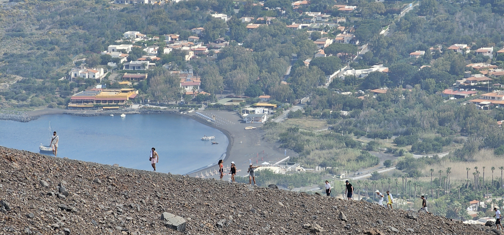

               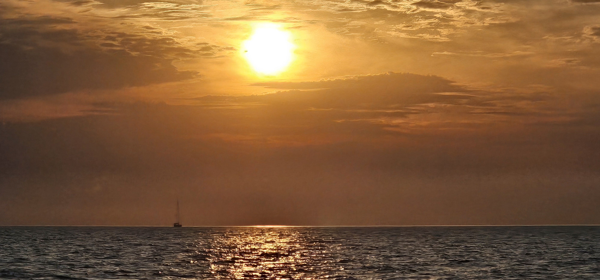

             

Photos from previous expeditions.

          Meet Your Captain

## Your Skipper

                     

                ⚓ Skipper

### Robertas Vaitiekunas

Your Skipper & Sailing Enthusiast

This is my debut charter — and that's exactly why every detail matters more. After sailing as a co-skipper and learning the ropes hands-on alongside an experienced captain, I'm launching my own voyage. I hold an ISS license, I've trained on both monohulls and catamarans, and I've spent time studying the Aeolian waters.

What I bring isn't decades of routine — it's fresh energy, meticulous preparation, and a genuine commitment to making this trip extraordinary for every person on board. Your safety is non-negotiable. Your experience is my reputation. Let's build something memorable together.

                🧭
                ISS Licensed
                Internationally certified skipper

                🌊
                Co-Skipper Trained
                Learned from an experienced captain

                ⛵
                Dual Trained
                Monohull & catamaran experience

                🤝
                Safety Committed
                Your safety is non-negotiable

          The Investment

## Join the Adventure

Pricing from our completed expedition.
Send an inquiry to get notified about future trips.

### ✓
              What's Included

- ● Yacht Charter &
                Insurance
- ● Professional Skipper
- ● Dinghy & Outboard
                Engine
- ● Final Yacht Cleaning
- ● Bed Linen & Towels
- ● Sailing Guidance &
                Training
- ● Pre-trip Planning
                Assistance

                Sailing Complete

                Lagoon 38 Catamaran

              €650
              per person

               [Send Inquiry](#join)

Prices subject to change.

### ✕
              Additional Costs

- ●

                  Operating Kitty (~€200)
                  Covers fuel, marina fees, and breakfast/lunch provisions.
- ●

                  Security Deposit (€250)
                  Fully refundable if no damages occur.
- ● Flights & Transfers
- ● Dinners at
                Restaurants

            Sailing Complete

## Future Inquiries

The 2026 Sicily expedition is now complete. Send us an inquiry to express interest and be the first to know about our next sailing adventures!

              Name

              Email

              Message / Request

                Send Request

          We use cookies to enhance your experience. By continuing to visit this
          site you agree to our use of cookies.
           [Read our Privacy Policy.

            Accept](privacy.html)

```json
{
  "@context": "https://schema.org",
  "@graph": [
    {
      "@type": "Organization",
      "@id": "https://www.velavidasails.com/#organization",
      "name": "Vela Vida Yachting",
      "url": "https://www.velavidasails.com",
      "logo": "https://www.velavidasails.com/images/VelaVidaLogo.png",
      "sameAs": [
        "https://instagram.com/velavidasails"
      ],
      "contactPoint": {
        "@type": "ContactPoint",
        "email": "join@velavidasails.com",
        "contactType": "customer service"
      }
    },
    {
      "@type": "Product",
      "@id": "https://www.velavidasails.com/#product",
      "name": "Lagoon 38 Catamaran Charter",
      "description": "Award-winning Lagoon 38 catamaran for flotilla sailing in Sicily. Features 4 cabins, 2 bathrooms, and spacious living areas.",
      "brand": {
        "@type": "Brand",
        "name": "Lagoon Catamarans"
      },
      "offers": {
        "@type": "Offer",
        "price": "650",
        "priceCurrency": "EUR",
        "availability": "https://schema.org/InStock",
        "url": "https://www.velavidasails.com/#join"
      }
    },
    {
      "@type": "Event",
      "@id": "https://www.velavidasails.com/#event",
      "name": "Sicily Sailing Flotilla 2026",
      "description": "Join Vela Vida for an exclusive 7-day sailing flotilla in Sicily. Navigate the Aeolian Islands (Stromboli, Panarea, Vulcano) aboard a luxury Lagoon 38 catamaran. Perfect for singles, couples, and groups seeking an authentic Italian sailing holiday.",
      "startDate": "2026-05-16",
      "endDate": "2026-05-23",
      "eventStatus": "https://schema.org/EventScheduled",
      "eventAttendanceMode": "https://schema.org/OfflineEventAttendanceMode",
      "location": {
        "@type": "Place",
        "name": "Palermo, Sicily",
        "address": {
          "@type": "PostalAddress",
          "addressLocality": "Palermo",
          "addressRegion": "Sicily",
          "addressCountry": "IT"
        }
      },
      "image": "https://www.velavidasails.com/images/20240517_094945-mobile.webp",
      "organizer": {
        "@id": "https://www.velavidasails.com/#organization"
      },
      "offers": {
        "@type": "Offer",
        "name": "Catamaran Berth",
        "price": "650",
        "priceCurrency": "EUR",
        "availability": "https://schema.org/InStock",
        "url": "https://www.velavidasails.com/#join",
        "validFrom": "2026-01-01"
      }
    },
    {
      "@type": "TouristTrip",
      "name": "Aeolian Islands Sailing Adventure",
      "description": "7-day flotilla sailing adventure through the Aeolian Islands (Stromboli, Vulcano, Lipari, Panarea, Salina) starting and ending in Palermo, Sicily.",
      "touristType": [
        "Sailing enthusiasts",
        "Adventure travelers",
        "Nature lovers"
      ],
      "itinerary": {
        "@type": "ItemList",
        "itemListElement": [
          {
            "@type": "ListItem",
            "position": 1,
            "name": "Palermo - Start"
          },
          {
            "@type": "ListItem",
            "position": 2,
            "name": "Vulcano - Volcanic hot springs"
          },
          {
            "@type": "ListItem",
            "position": 3,
            "name": "Panarea - Boutique island"
          },
          {
            "@type": "ListItem",
            "position": 4,
            "name": "Stromboli - Active volcano"
          },
          {
            "@type": "ListItem",
            "position": 5,
            "name": "Salina - Wine country"
          },
          {
            "@type": "ListItem",
            "position": 6,
            "name": "Lipari - Historical heart"
          }
        ]
      }
    },
    {
      "@type": "WebSite",
      "@id": "https://www.velavidasails.com/#website",
      "url": "https://www.velavidasails.com",
      "name": "Vela Vida Yachting",
      "publisher": {
        "@id": "https://www.velavidasails.com/#organization"
      }
    },
    {
      "@type": "WebPage",
      "@id": "https://www.velavidasails.com/",
      "url": "https://www.velavidasails.com/",
      "name": "Sicily Sailing Flotilla 2026 | Lagoon 38 Catamaran | Vela Vida",
      "description": "Join the 2026 Elmár Flotilla in Sicily aboard the award-winning Lagoon 38 catamaran. May 16-23, 2026. Join our flotilla sailing adventure from Palermo, Sicily.",
      "isPartOf": {
        "@id": "https://www.velavidasails.com/#website"
      }
    }
  ]
}
```
